# 👥 💬 ℹ️
# Rozprzestrzenianie się informacji w sieci

Dawid Karpiński, 14.06.2024 r.

---

1. Cel projektu
2. Model SIS
3. Użyty algorytm
4. Prezentacja wyników

---

## 1. Cel projektu

- modyfikacja parametrów $\beta=\beta(k)$ i $\gamma=\gamma(k)$
- porównanie Barabasi-Albert vs. Erdos-Renyi

---

## 2. Model SIS

---

$$
\Large I(t+\Delta{t}) = I(t) + \beta S(t) I(t) \Delta{t} - \gamma I(t) \Delta{t}
$$

$$
\Large dI(t)/dt = \beta S I - \gamma I
$$

tempo rozprzestrzeniania się:

$$
\Large \lambda = \beta / \gamma
$$

---

## 3. Użyty algorytm

1. Inicjalizacja parametrów symulacji
2. Iteracja po każdym węźle w sieci
    - Wybór węzła $i$ posiadającego informację
    - Przekazanie informacji podatnym sąsiadom $j$ według $\beta$
    - Zapomnienie informacji przez $i$ według $\gamma$

---

## 4. Prezentacja wyników

---

$$
\Large \beta = 0.1 = \gamma
$$

---

$$
\Large \beta = 0.1
$$

$$
\Large \gamma = 0.8
$$

---

$$
\Large \beta = 0.8
$$

$$
\Large \gamma = 0.1
$$

---

## Wpływ stopnia "pacjenta zero"

---

---

## Modyfikacja parametrów

$$
\Large \beta(k_i) = \beta_0 \cdot k / k_{\max}
$$

$$
\Large \gamma(k_i) = \gamma_0 \cdot k / k_{\max}
$$

---

## Wpływ na próg epidemii

$$
\Large \beta_0 = 0.1 = \gamma_0
$$

---

$\large \beta, \gamma = \text{const}$

---

$$
\Large \beta=\beta(k)
$$

$$
\Large \gamma=\text{const}
$$

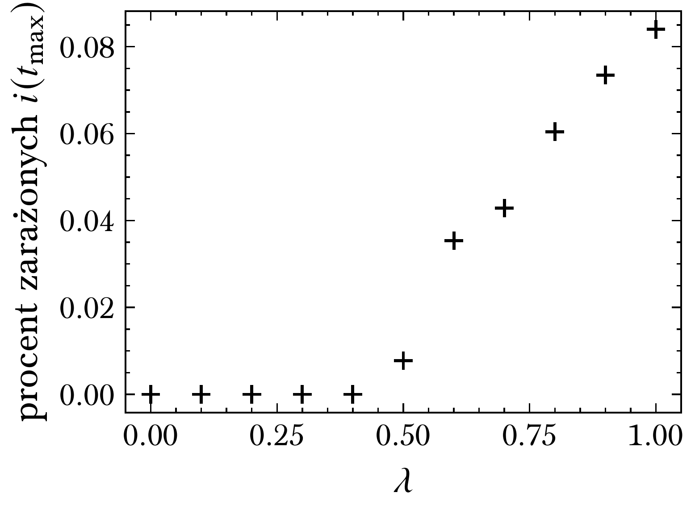

---

$$
\Large \beta=\text{const}
$$

$$
\Large \gamma=\gamma(k)
$$

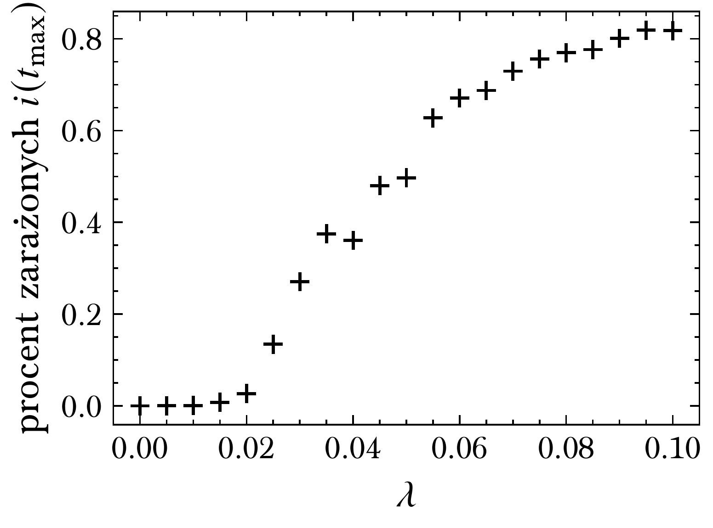

---

$$
\Large \beta=\beta(k)
$$

$$
\Large \gamma=\gamma(k)
$$

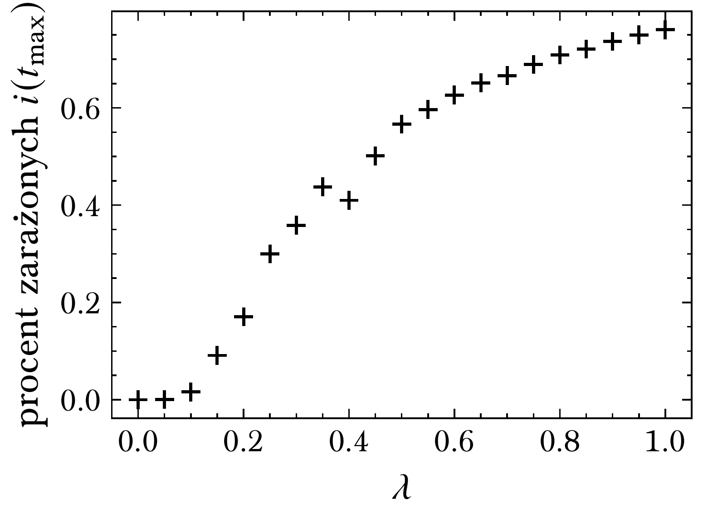

---

---

## Wpływ średniego stopnia

---

---

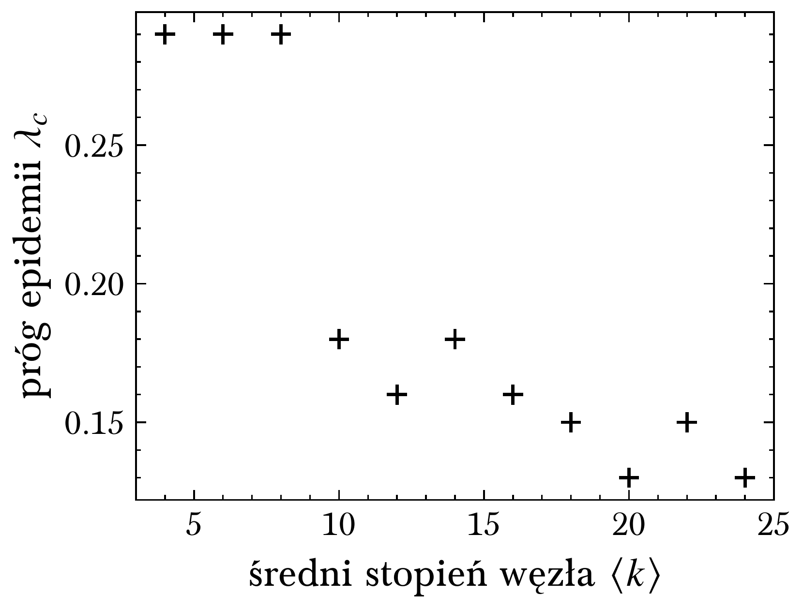
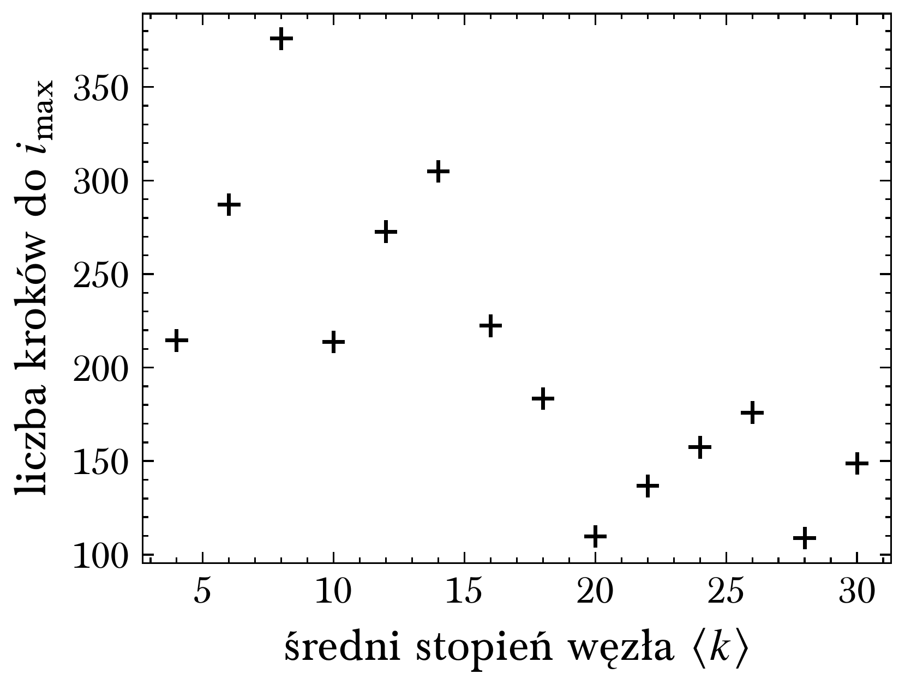

---

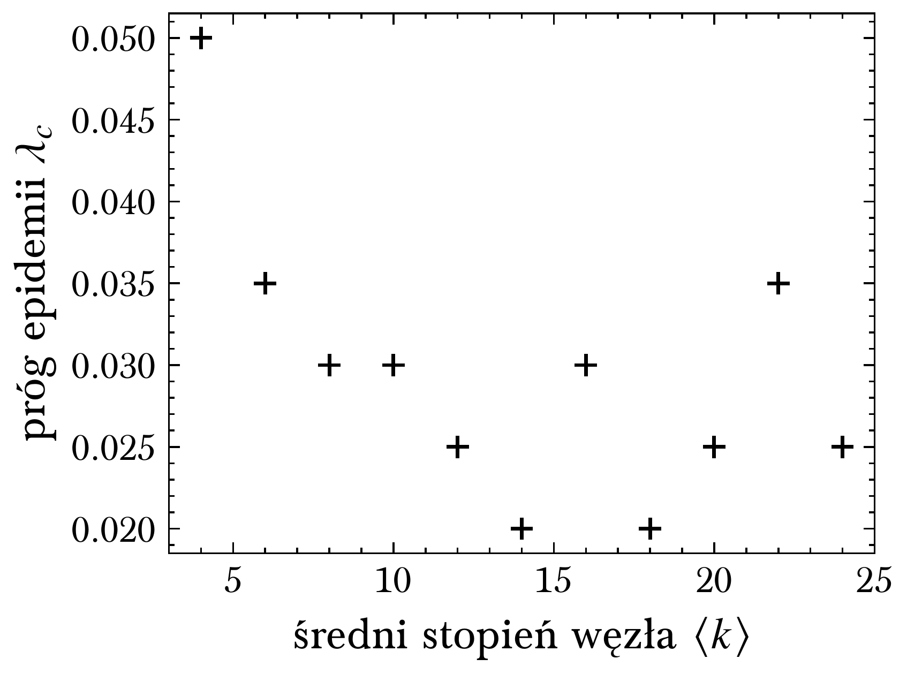
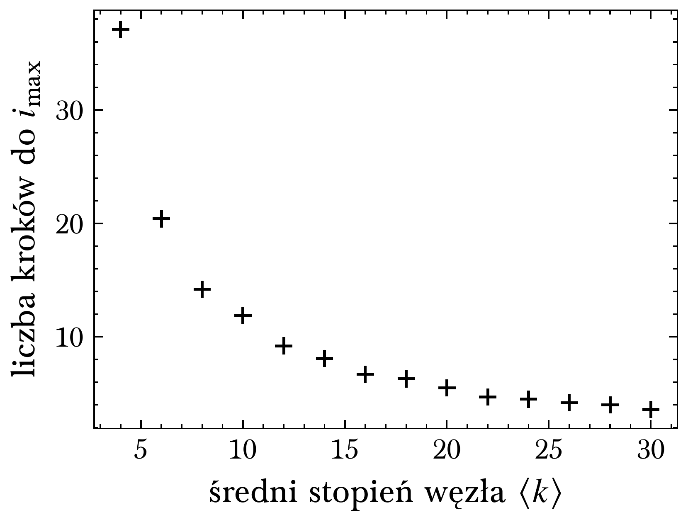

---

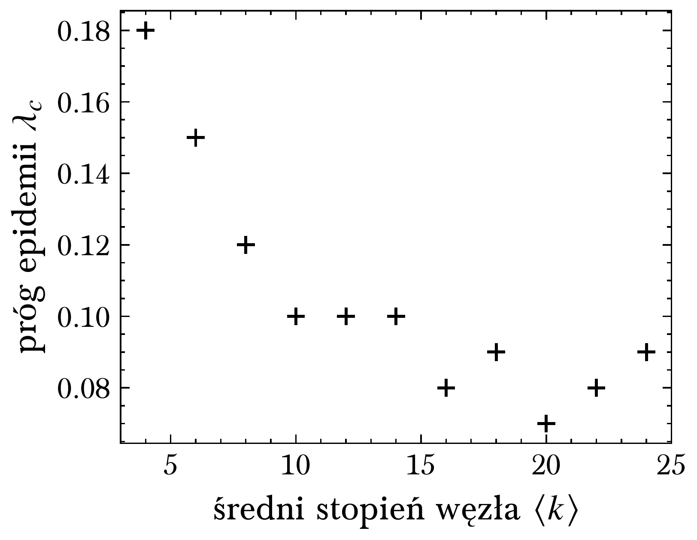
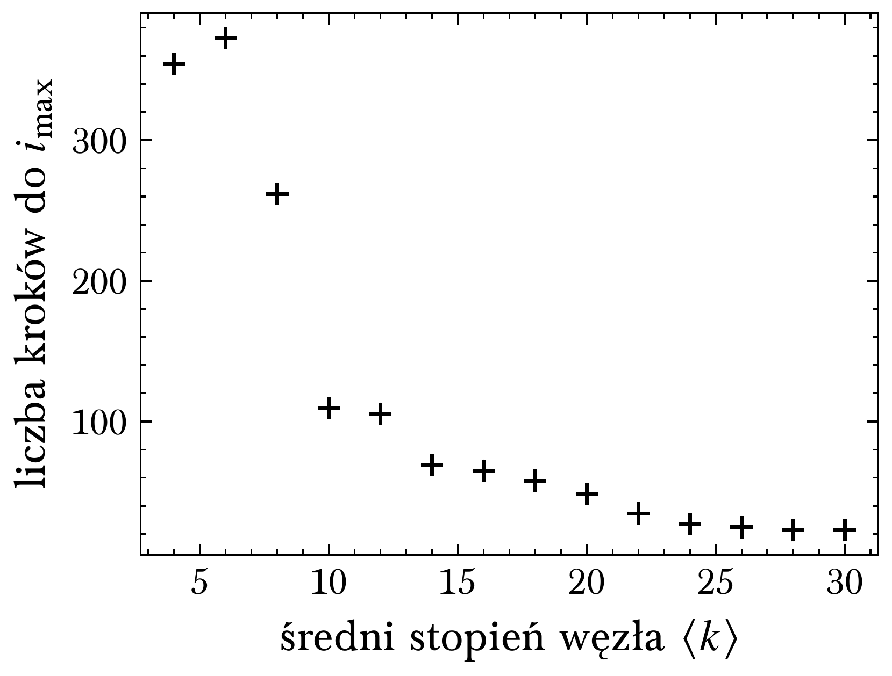

---

## BA vs. ER

---

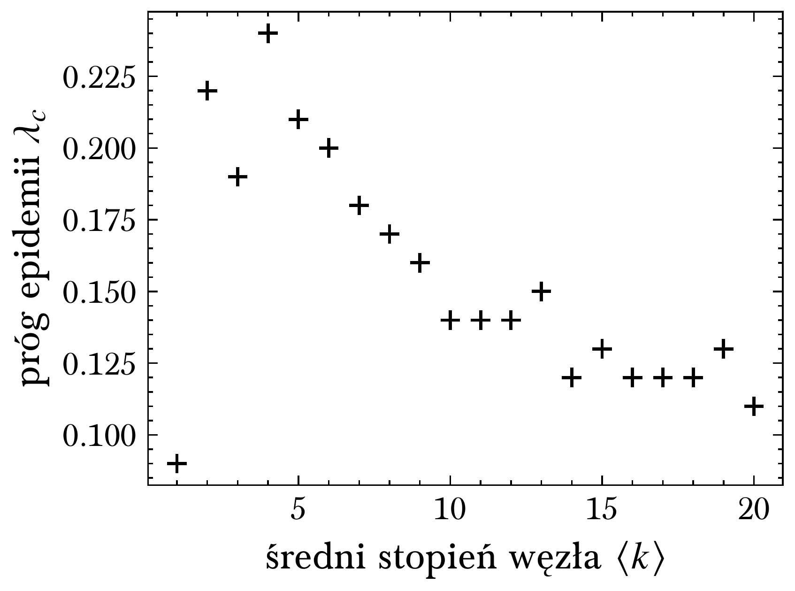

---

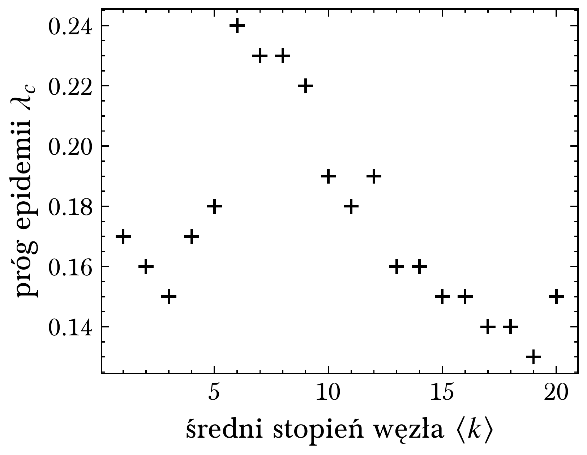
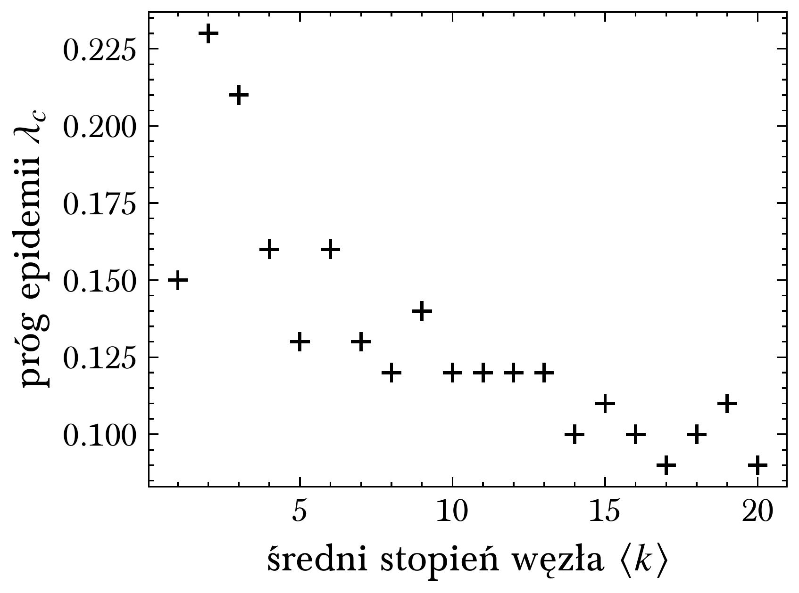

---

## Wnioski

- zamysł modyfikacji parametrów:
    - ufność źródła informacji $\propto$ stopień węzła
- BA:
    - $\beta(k)$ => wyższa wartość $\lambda_c$
    - $\gamma(k)$ => niższa wartość $\lambda_c$
    - $\beta(k)$ i $\gamma(k)$ => bliskie klasycznemu
- ER:
    - brak znaczących różnic

---

<!-- paginate: skip -->

# Dziękuję za uwagę

:)
