# 🦠 😷 👥
# Symulacja epidemii  w sieciach złożonych

Dawid Karpiński, 13.06.2024 r.

---

# Model SIS

---

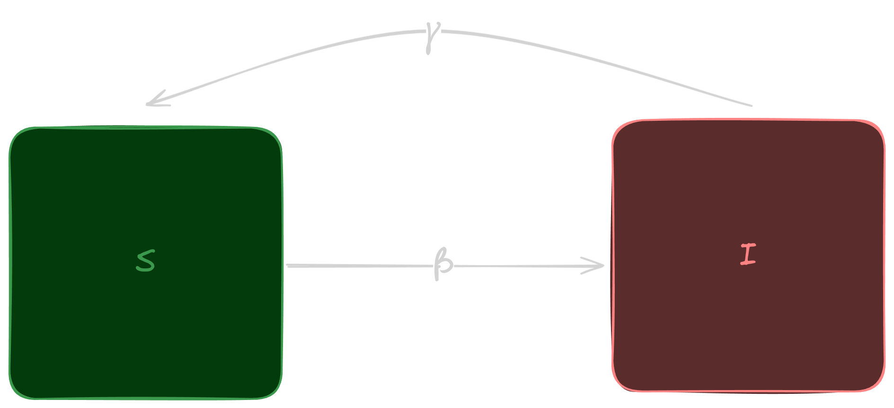

---

$$
\Large I(t+\Delta{t}) = I(t) + \beta S(t) I(t) \Delta{t} - \gamma I(t) \Delta{t}
$$

$$
\Large dI(t)/dt = \beta S I - \gamma I
$$

tempo epidemii:

$$
\Large \lambda = \beta / \gamma
$$

---

# Sieć Barabasi-Albert

---

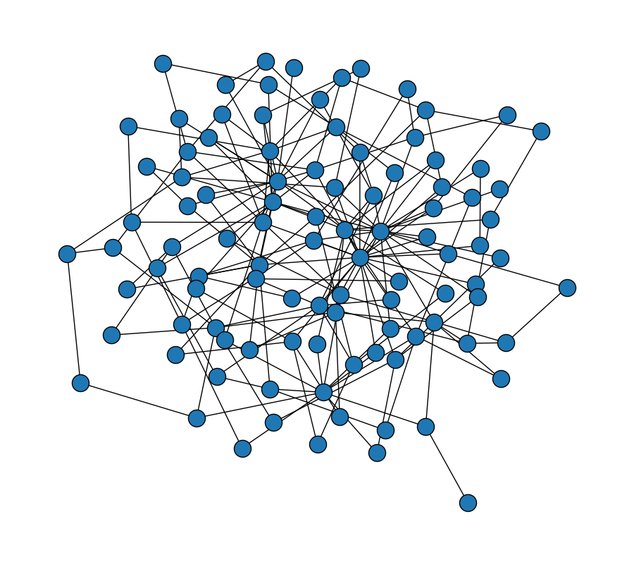

$$
\Large N, m
$$

$$
\large P(k)\sim k^{-3}
$$

- potęgowy rozkład węzłów
- preferential attachment

---

## Algorytm

1. Inicjalizacja sieci BA
2. Wybór zarażonego agenta $i$
3. Dla każdego niezarażonego sąsiada $j$:
    - zarażenie $j$ z prawdopodobieństwem $\beta$
4. Wyzdrowienie agenta $i$ z prawdopodobieństwem $\gamma$

---

# Wyniki

---

$$
\Large \beta = 0.1 = \gamma
$$

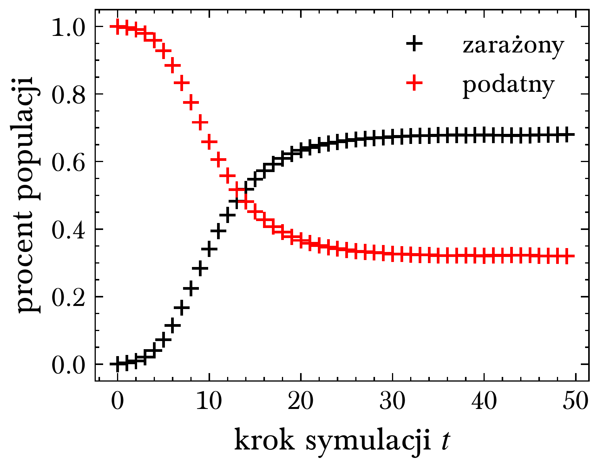

---

$$
\Large \beta = 0.1
$$

$$
\Large \gamma = 0.2, 0.4, 0.8
$$

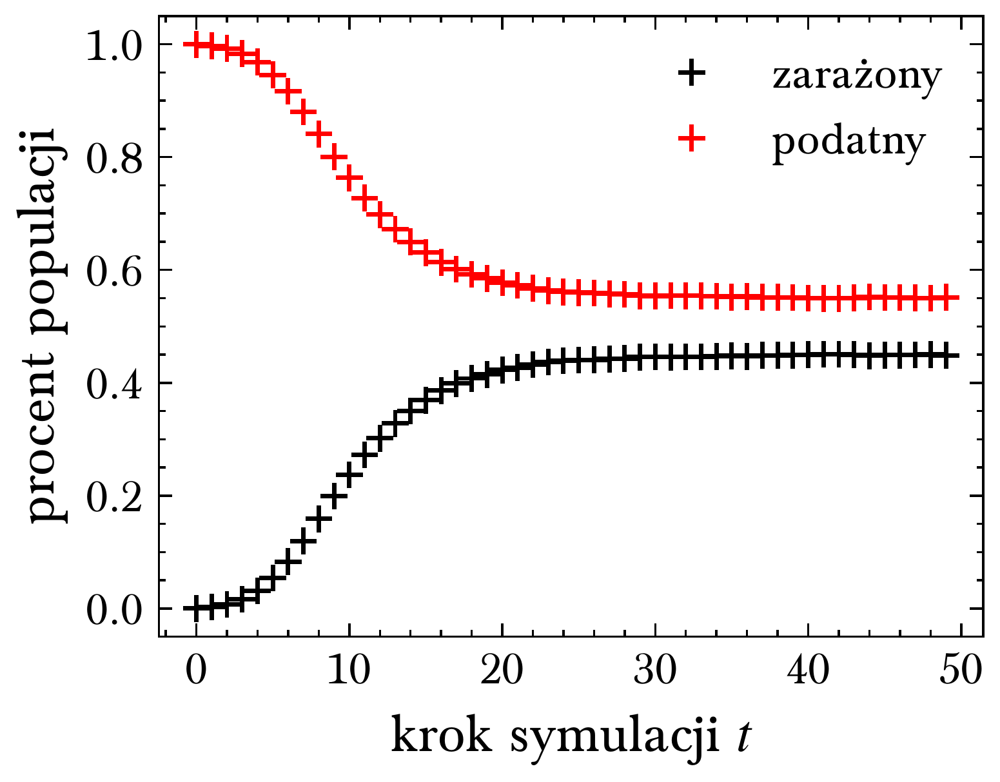
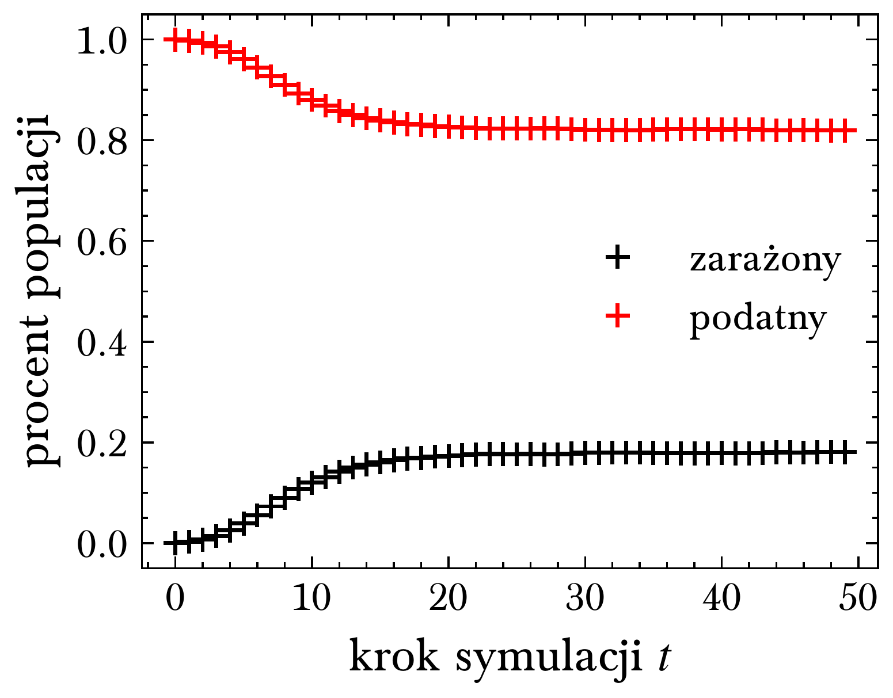
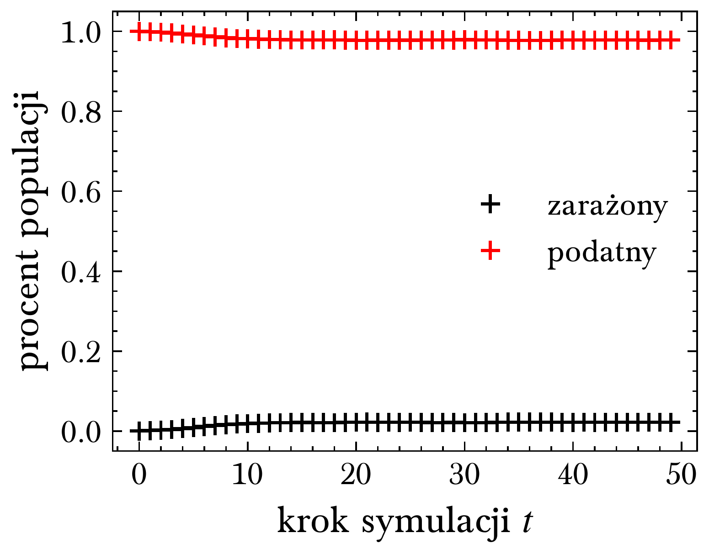

---

$$
\Large \gamma = 0.1
$$

$$
\Large \beta = 0.2, 0.4, 0.8
$$

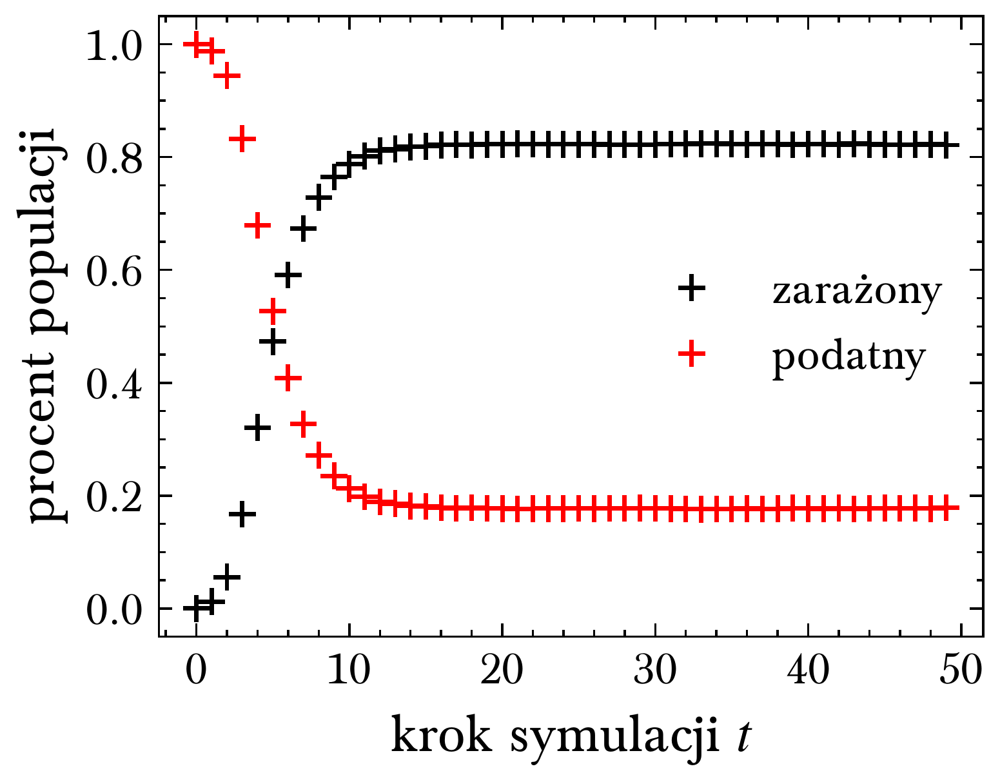
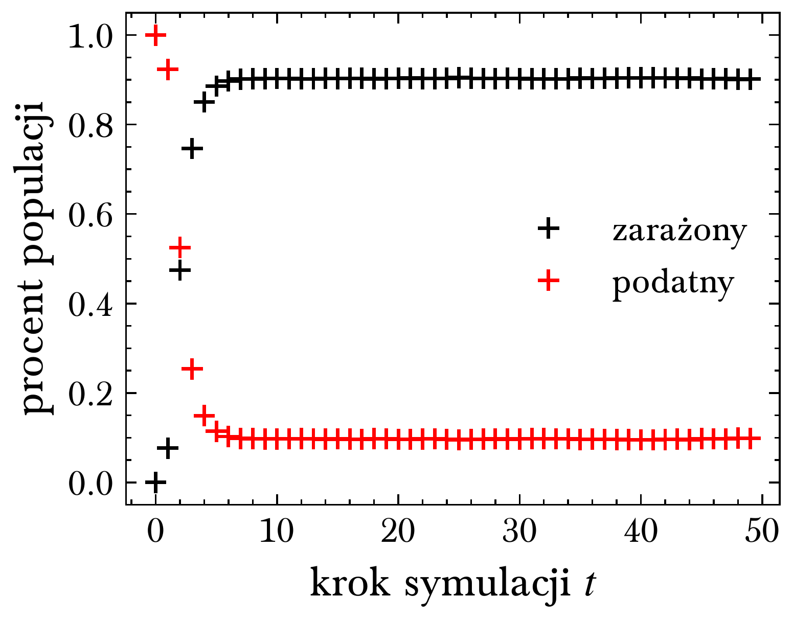
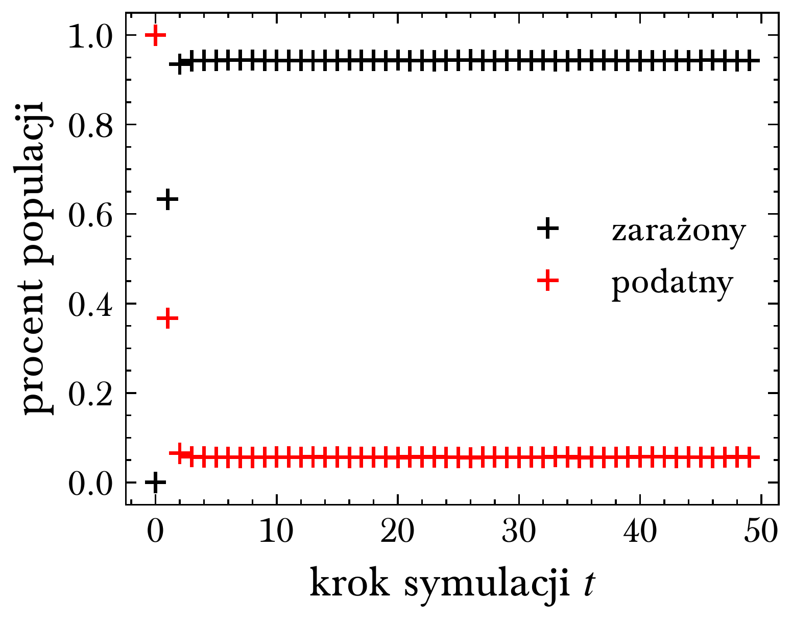

---

# Próg epidemii

---

dla sieci BA ($n=1000$, $m=2$)

$$
\LARGE \lambda_c = \braket{k}/\braket{k^2} \approx 0.1006962
$$

---

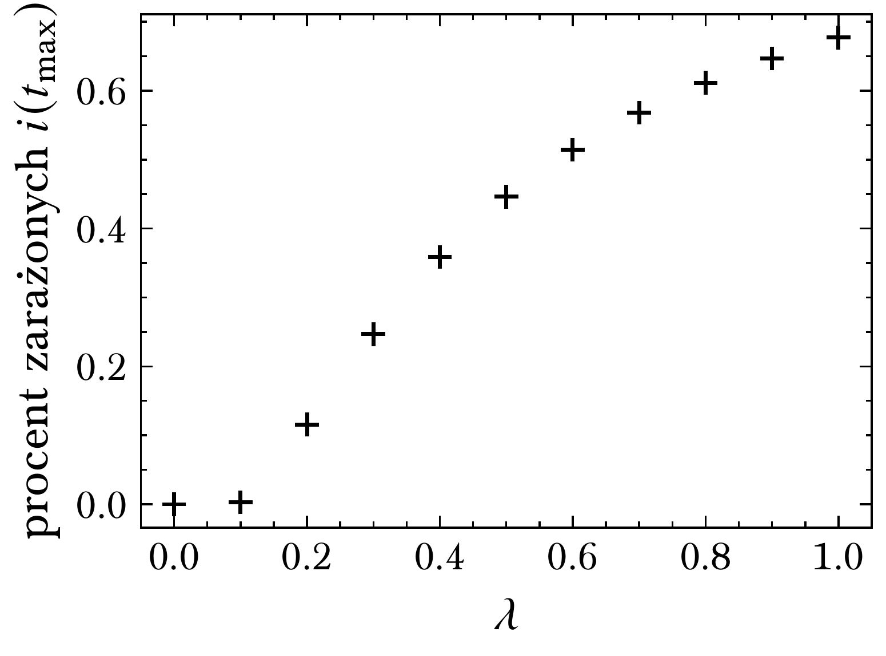

---

# Jak na epidemię wpływa średni stopień w sieci?

---

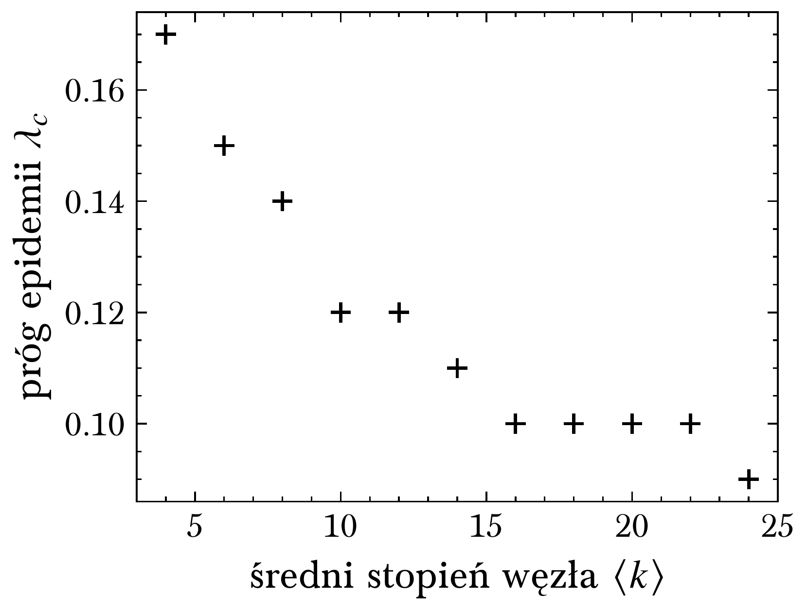

---

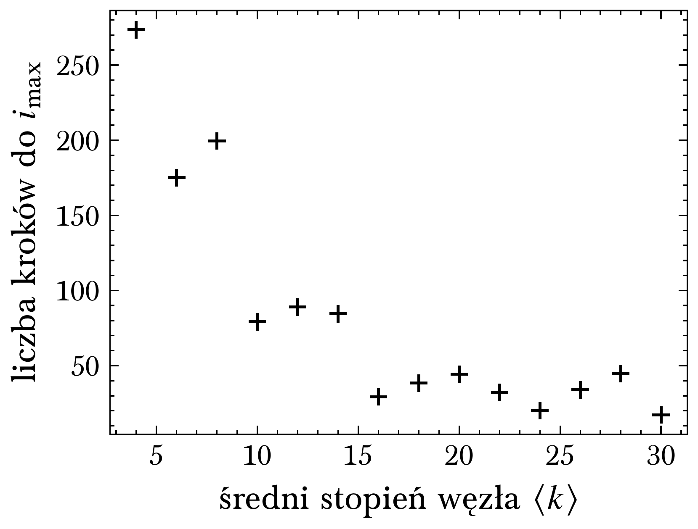

---

# Jaki wpływ na rozwój epidemii ma stopień pacjenta zero?

---

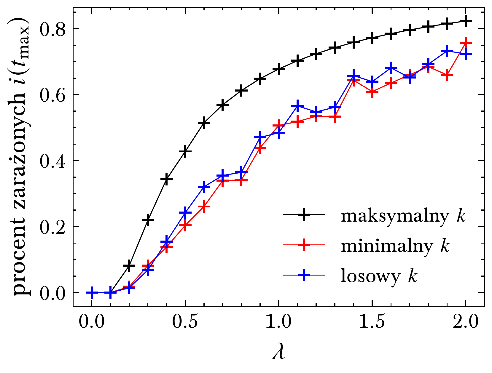

---

<!-- paginate: skip -->

# Dziękuję za uwagę

:)
